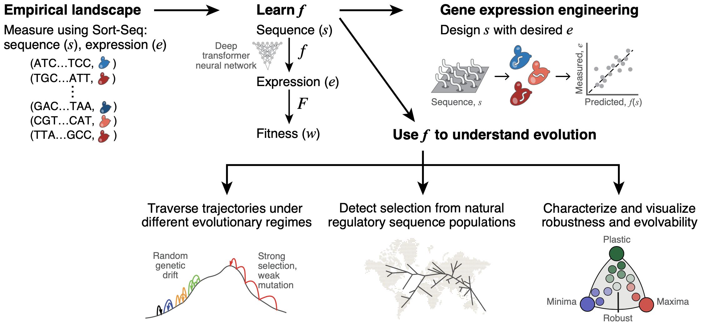

Dear User,

This repository contains the code for our <a href = "https://doi.org/10.1101/2021.02.17.430503">manuscript</a> : 

 <h3 align="center">A comprehensive fitness landscape model reveals the evolutionary history and future evolvability of eukaryotic <i>cis</i>-regulatory DNA sequences</h3>

All data and trained models used in the manuscript can be downloaded : <a href='https://zenodo.org/record/4436477#.X_8V-hNKgUF'>🗄️</a>.

You may also interface with the models using our interactive web app : <a href='https://baa6bf8ceab2.ngrok.io/'>🤖</a>.

The conda environment required for running this notebook can be installed and activated by running the following on the command line from within this folder: \
<code>conda env create -f evolution_env.yml </code>  \
<code>conda activate me</code>

This directory is organized into the following subdirectories :
<ul>

    
<li> <code>ecc_mr_fr</code>: contains the notebooks for computing the Expression Conservation Coefficient (ECC), Mutational Robustness and Fitness Responsivity.
    
<li> <code>evolvability</code> : contains the notebooks for computing the evolvability vectors and their two-dimensional representations. It also has examples for generating the landscape visualizations shown in the manuscript that the user may use for their own new sequences.
    
<li> <code>ga</code> : contains the notebooks for sequence design using a genetic algorithm.

<li> <code>model</code> : contains the notebooks for pre-processing the data, training the model and using the model. This model can run on TPUs and GPUs. A subfolder called 'gpu_only_model' contains the same for the version of the model that runs on GPUs only (and not TPUs) as described in the manuscript.
    
<li> <code>rna_seq</code> : contains all the code used for processing the in-house cross-species RNA-seq data.

<li> <code>trajectories</code> : contains the notebooks for computing the sequence trajectories under different evolutionary regimes.

</ul>
 

  
 

